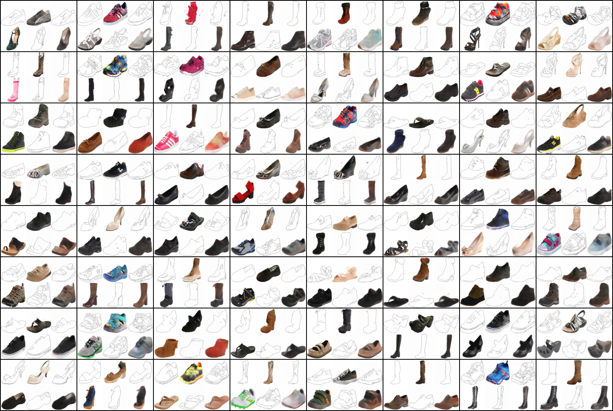
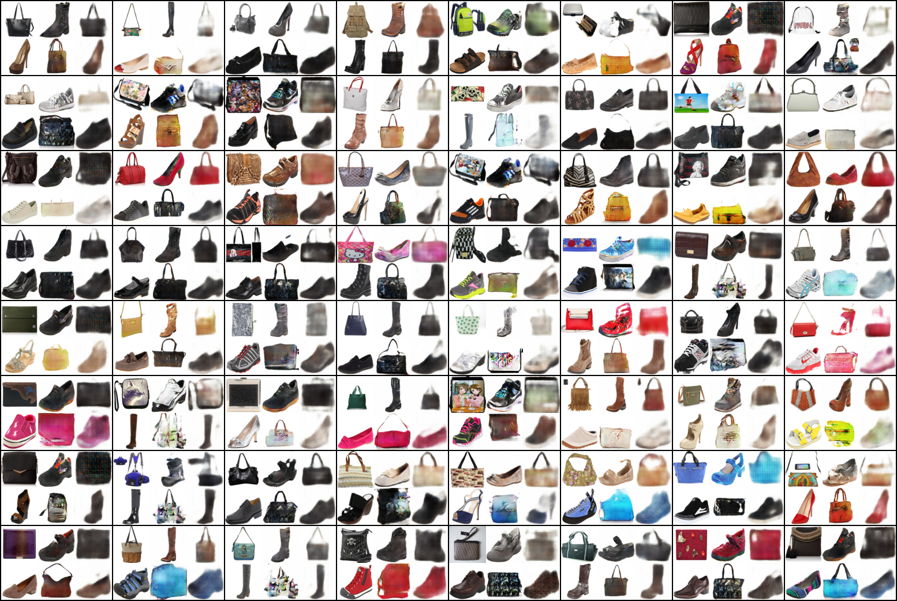
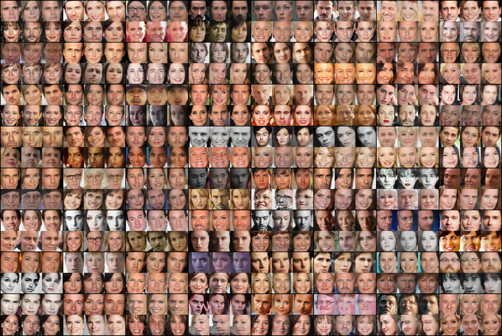

# DiscoGAN in Pytorch

Study Friendly Implementation of DiscoGAN in Pytorch

More Information: [Original Paper](https://arxiv.org/pdf/1703.05192.pdf)

Implemenation based on [Official Implementation](https://github.com/SKTBrain/DiscoGAN), but Simplified.

- GAN: [[Pytorch](https://github.com/taeoh-kim/GANin50lines)][[Tensorflow](https://github.com/HyeongminLEE/GANin50lines)]
- DCGAN: [[Pytorch](https://github.com/taeoh-kim/Pytorch_DCGAN)][[Tensorflow](https://github.com/HyeongminLEE/Tensorflow_DCGAN)]
- InfoGAN: [[Pytorch](https://github.com/taeoh-kim/Pytorch_InfoGAN)][Tensorflow]
- Pix2Pix: [[Pytorch](https://github.com/taeoh-kim/Pytorch_Pix2Pix)][[Tensorflow](https://github.com/HyeongminLEE/Tensorflow_Pix2Pix)]
- DiscoGAN: [[Pytorch](https://github.com/taeoh-kim/Pytorch_DiscoGAN)][[Tensorflow](https://github.com/HyeongminLEE/Tensorflow_DiscoGAN)]

## 1. Environments

- Ubuntu 16.04
- Python 3.6 (Anaconda)
- Pytorch 0.2.0
- Torchvision 0.1.9
- PIL
- cv2 (OpenCV) (pip install python-opencv)

## 2. Code Description

- `discogan.py`: Main Code
- `discogan_test.py`: Test Code after Training
- `network.py`: Generator and Discriminator
- `db/download.sh`: DB Downloader (Edges/Shoes/Handbags)
- `db/download.py`: DB Downloader (Facescrub)

## 3. Networks and Parameters

### 3.1 Hyper-Parameters

- Image Size = 64x64
- Batch Size = 64
- Learning Rate = 0.0002
- Weight Decay = 0.00001
- Adam_beta1 = 0.5
- Loss Weights: See the code
- Scheduling: See the code

### 3.2 Generator Networks (network.py)

<p align="center"></p>

### 3.3 Discriminator Networks (network.py)

<p align="center"></p>

## 4. DB Download

### 4.1 Edges2Shoes / Edges2Handbags / Handbags2Shoes

```bash
./db/download.sh dataset_name
```

dataset_name can be one of [edges2shoes, edges2handbags]

You can do handbags2shoes using both datasets.

- `edges2shoes` : 600x500, 1096 for Train, 1098 for Val
- `edges2handbags` : 256x256, 138567 for Train, 200 for Val

### 4.2 Facescrubs

```bash
python ./db/download.py
```

This code downloads face image independently. So there are some problems.

After download images 10~20k,

You should remove some broken images MANUALLY. :<

- `facescrub/actors/face` : Various Size
- `facescrub/actresses/face` : Various Size

## 5. Train

### 5.1 edges2shoes (or handbags)

```bash
python discogan.py --task edges2shoes #(or handbags)
```

### 5.2 Handbags2Shoes

```bash
python discogan.py --task handbags2shoes --starting_rate 0.5
```

### 5.3 Facescrubs

```bash
python discogan.py --task facescrubs
```

## 6. Test

After finish training, saved models are in the `./models` directory.

```bash
python discogan_test.py --task taskname --num_epochs N --batctSize M
```

- `batchSize` means test sample size.
- `num_epochs` is the parameter which model will be used for test.

Test results will be saved in `./test_result`

## 7. Results

### [Input A | A to B | A to B to A]
### [Input B | B to A | B to A to B]

### Edges to Shoes, Shoes to Edges (20 Epochs)

<p align="center"></p>

### Handbags to Shoes, Shoes to Handbags (30 Epochs)

<p align="center"></p>

### Face: Men to Women, Women to Men (150 Epochs)

<p align="center"></p>
